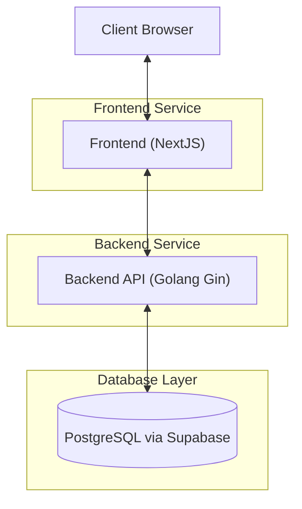
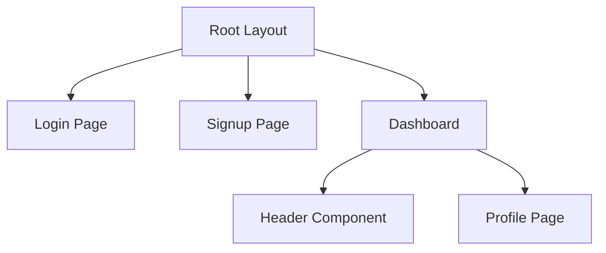
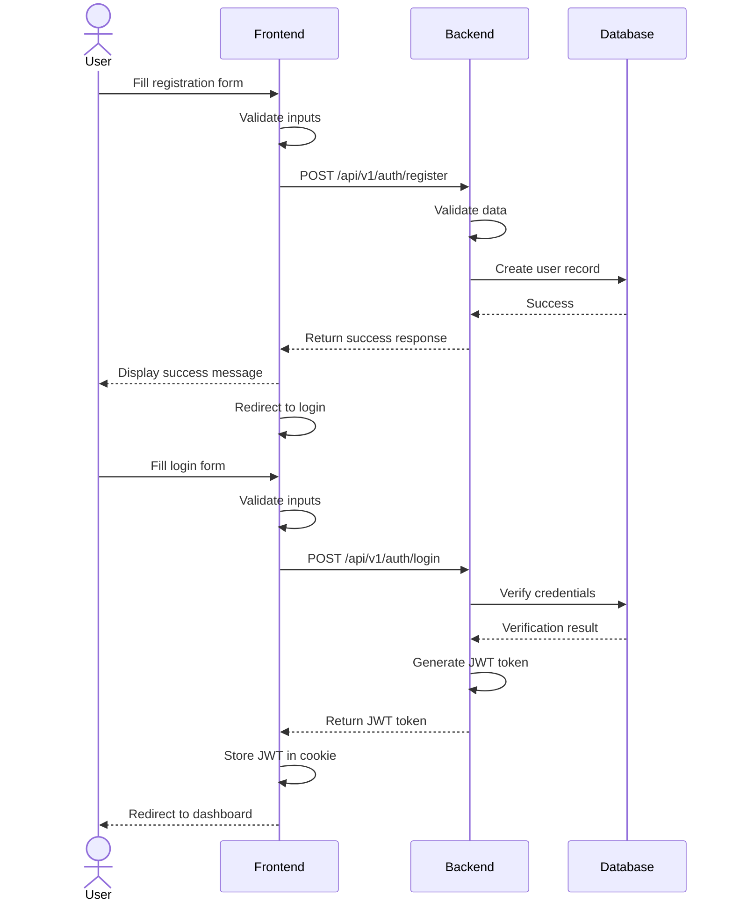
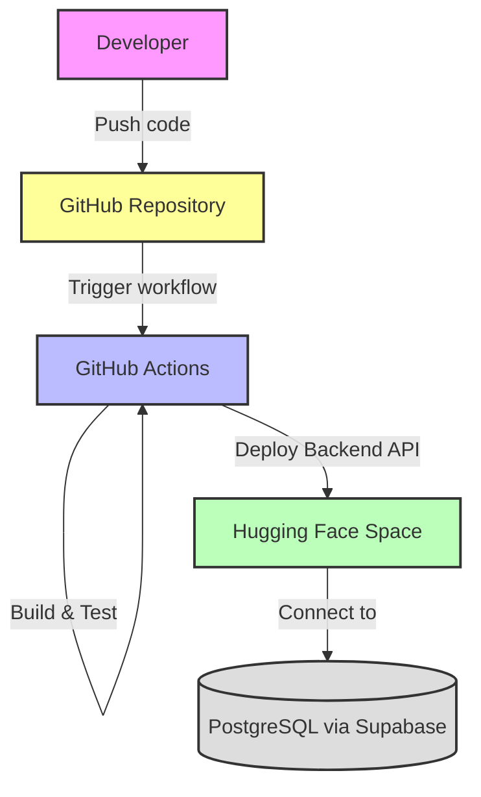
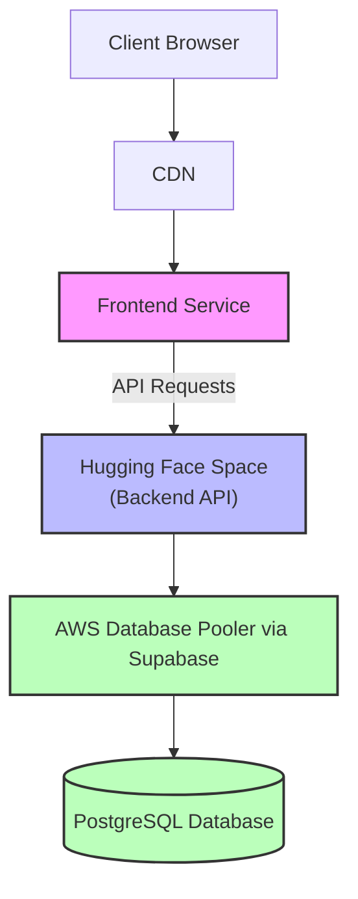

# JMK48 Membership Area - Technical Documentation
# Please Check This Out!
- [The Website Result](https://abdanhafidz.com/jmk48-membership)
- [API Endpoint Huggingface](https://huggingface.co/spaces/lifedebugger/pweb-api-ets)
- [API Documentation](https://documenter.getpostman.com/view/13117366/2sB2j3BBjT)
- [Demonstration Video](https://youtube.com/)
## Project Overview

The JMK48 Membership Area is a comprehensive web application designed to manage member registration, authentication, and profile management. Built using modern technologies and following microservices architecture, this application provides a secure and scalable solution for handling user membership functionalities.

## Architecture Overview

The application follows a microservices architecture pattern, separating the frontend and backend concerns to enable independent development, deployment, and scaling.

### Architecture Diagram



## Technology Stack

### Frontend
- **Framework**: Next.js with React
- **Styling**: Tailwind CSS
- **State Management**: React Hooks
- **Animations**: Framer Motion
- **Notifications**: React Hot Toast
- **Cookie Management**: js-cookie

### Backend
- **Language**: Golang
- **Framework**: Gin Web Framework
- **ORM**: GORM
- **Authentication**: JWT (JSON Web Tokens)

### Database
- **PostgreSQL** hosted on AWS via Supabase
- **Connection Pooling**: AWS Database Pooler

## Frontend Components Structure



## Authentication Flow




## Backend Structure (Golang)

Based on the project structure shown in the image, the Golang backend is organized as follows:

```
/.github/workflows   # GitHub Actions workflow configurations
/.godo               # Go task automation files
/config              # Application configuration files
/controller          # API endpoint handlers
/logs                # Application logs
/middleware          # Auth middleware, CORS, logging middleware, etc.
/models              # Data models and database schema
/repositories        # Database operations and data access layer
/router              # API route definitions
/services            # Business logic implementation
/utils               # Helper functions and utilities
/views               # Template rendering (if applicable)
/.env                # Environment variables (not in version control)
/.env.example        # Example environment variable template
/.gitignore          # Git ignore rules
/Dockerfile          # Container definition for deployment
/go.mod              # Go module dependencies
/go.sum              # Go module checksums
/LICENSE             # Project license
/main.go             # Application entry point
/README.md           # Project documentation
```

This structure follows the clean architecture principles, separating concerns into different layers:
- Presentation layer (controllers, router)
- Business logic layer (services)
- Data access layer (repositories)
- Domain layer (models)

## Frontend Structure (NextJS)

```
/app
  /components          # Reusable UI components
    Header.tsx
    ...
  /dashboard           # Dashboard page
    page.tsx
  /login               # Login page
    page.tsx
  /profile             # Profile page
    page.tsx
  /signup              # Signup page
    page.tsx
  layout.tsx           # Root layout
  globals.css          # Global styles
/public                # Static assets
/lib                   # Utility functions and hooks
```

## Authentication and Security

- **JWT Token**: Used for maintaining user sessions
- **Password Security**: Passwords are hashed before storing in the database
- **Protected Routes**: Routes that require authentication are protected on both frontend and backend

## CI/CD and Deployment Architecture

The project uses GitHub Actions for CI/CD pipeline automation, deploying the backend API to Hugging Face Spaces.

### CI/CD Pipeline



### Deployment Architecture



The backend API is deployed to Hugging Face Spaces at: https://huggingface.co/spaces/lifedebugger/pweb-api-ets

This deployment approach provides:
- Automated testing and deployment on each commit
- Containerized deployment using Docker
- Scalable infrastructure with managed services
- Separation of frontend and backend deployments
- Connection to a production-grade database service

## Performance Considerations

1. **Connection Pooling**: AWS Database Pooler via Supabase optimizes database connections
2. **Stateless Backend**: Enables horizontal scaling of the API service
3. **CDN Integration**: Static assets are served through CDN for faster delivery
4. **Client-side Caching**: JWT tokens stored in cookies reduce authentication overhead

## Relevance to Project Objectives

This implementation successfully addresses all the project requirements for the "Member Registration Portal" mid-term evaluation:

### 1. HTML Form Structure for User Input
- Implemented complete registration and login forms using React components
- Structured with proper input fields for all required user data
- Enhanced with modern UI elements and responsive design

### 2. JavaScript Data Validation
- Client-side validation implemented in both signup and login forms
- Real-time feedback provided through React state management
- Error handling with toast notifications for improved user experience

### 3. Responsive and Attractive Form Layout
- Used Tailwind CSS for responsive design
- Enhanced with animations through Framer Motion
- Implemented gradient styling and modern UI components
- Ensures consistent appearance across different screen sizes

### 4. Data Storage and Display
- Advanced beyond the requirement of localStorage by implementing:
  - Full database storage with PostgreSQL
  - User authentication with JWT
  - Session management with cookies
- Provides a complete dashboard for displaying and managing member data

### Additional Achievements
- Implemented a complete microservices architecture
- Created a full authentication system with registration, login, and profile management
- Added security features like JWT authentication and password hashing
- Designed a scalable solution using enterprise-grade technologies

## Conclusion

The JMK48 Membership Area demonstrates a comprehensive implementation of a modern web application using microservices architecture. By leveraging NextJS for the frontend and Golang with Gin and GORM for the backend, the application provides a robust, secure, and scalable solution for membership management. The integration with PostgreSQL via Supabase and AWS Database Pooler ensures efficient data storage and retrieval, making this project not just a fulfillment of the assignment requirements but a production-ready application.
